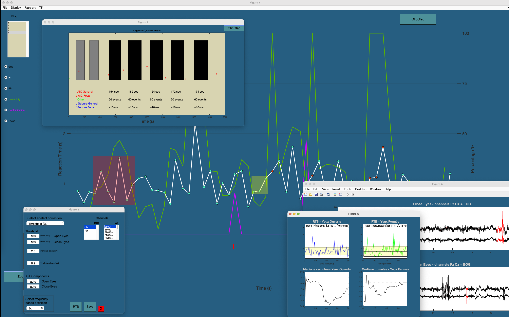

# Tool_BLAST_EEG
Tool GUI display BLAST exam from HFME

This tool is the result of work with Vania Herbillon.   

# Functions

- EEG files Reading (TRC, Vamp, mat files)   
- Attention scores extraction from the BLAST exam   
- Automatic report generation for clinical use (BLAST, AIC)   
- Fine display of BLAST design, AIC and attentionnal metrics (RT, feedback, focus, instability)   
- Calculation of theta/beta ratio on resting state   

# Installation

Download **Visu_BLAST_EEG.mlappinstall** file and install app in your matlab editor.   

# UPDATE

### 02/10/21   
Selection of channels of interest for RTB calculation   
Output for each time window of the RTB calculation:
- spectrum
- theta
- beta
- RTB
### 18/11/21   
Selection of BLAST items to display.
### 26/01/22   
Import Vamp file (exept Blast events).
### 28/02/22   
Import Vamp Blast events.   
Fixe the Global Resume bug without eyes (opened, closed) signal.
### 22/03/22   
Features selection of RTB windows.    
Add some EOG labels.    
Selection of BLAST blocs    
### 14/04/22    
Merge several BLAST-AIC features within one *.txt file   
### 07/06/22    
FOOF spectral correction for RTB    
Artefact rejection based on spectrum    
Mensia's definition of frenquency bands adapted    
### 28/06/22     
RTB comput on corrected spectrum     
Huge MAJ on RTB algorythme     
### 18/03/24     
Import several TRC files 
save .mat object and .txt file with all Blast scores (Bloc and stim scales) and AIC informations 
