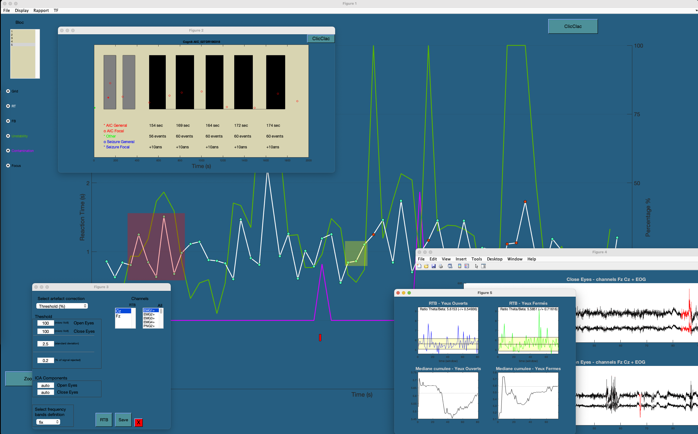

# Tool_BLAST_EEG
Tool GUI display BLAST exam from HFME

This tool is the result of work with Vania Herbillon.   

# Functions

- EEG files Reading (TRC, mat files)   
- Attention scores extraction from the BLAST exam   
- Automatic report generation for clinical use (BLAST, AIC)   
- Fine display of BLAST design, AIC and attentionnal metrics (RT, feedback, focus, instability)   
- Calculation of theta/beta ratio on resting state   

# Installation

Download **Visu_BLAST_EEG.mlappinstall** file and install app in your matlab editor.   

# UPDATE

### 02/10/21   
Selection of channels of interest for RTB calculation   
Output for each time window of the RTB calculation:
- spectrum
- theta
- beta
- RTB
### 18/11/21   
Selection of BLAST items to display.
